OPNsense firewall manager used to manage rules created with the firewall automation plugin and intended to run on android phones. This app is given to clients who aren't very technical and need something more simplistic than the web interface provided by OPNsense, so it is intentionally light in its capabilities. It provides the clients the ability to conduct immediate actions then raise a ticket to me to go in and make configuration changes as needed.

 **NOTE:** All rules you would like to control with this app need to be recreated using the firewall automation plugin https://docs.opnsense.org/development/api/plugins/firewall.html
 

## Current capabilities
- Stores API info in SQLite database.
    - Allows the user to manually paste keys, secret, URL/IP, and port number. (all Required to function)
- Firewall rule enable/disable  
    - Checks the current status of each rule on load.
    - Form to add rule uuids generted by firewall automation plugin
    - stores rule list locally in SQLite table.
    - Delete rule from SQLite table.
- Generates a device list based on the ARP table.
    - IP
    - Hostname
    - Reload arp table
    - Flush arp table 
- Wireguard management.
    - Displays connection information.
    - Enable/Disable toggle switch
- Reboot firewall
- Alias Management.
    - Displays list of aliases
    - Allows the addition of IP addresses. 
    - Deletion of IP addresses for an alias

### Usage
Download one of the releases or build with buildozer 
- Build with buildozer 
    - In accordance with https://github.com/kivy/buildozer 
    - For testing, enter the below command in the terminal. 
        - Connect the phone to the computer with a USB 
        - $ buildozer android debug deploy run logcat 
    - Or build an APK without pushing to a phone. 
        - $ buildozer android debug

### Screenshots
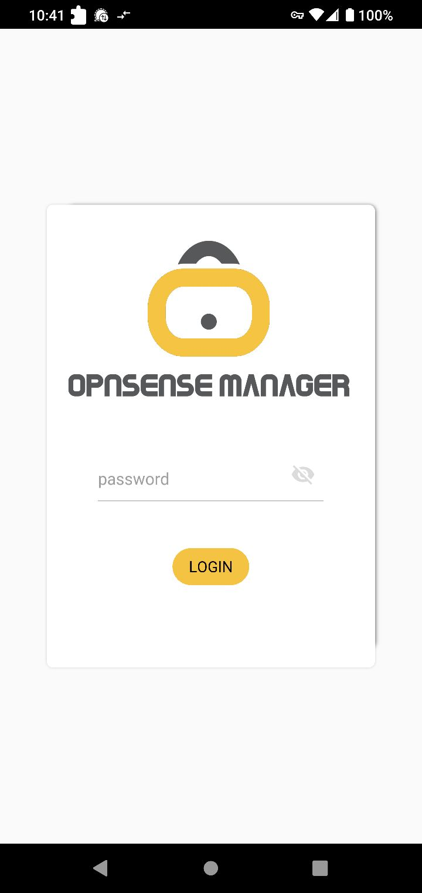  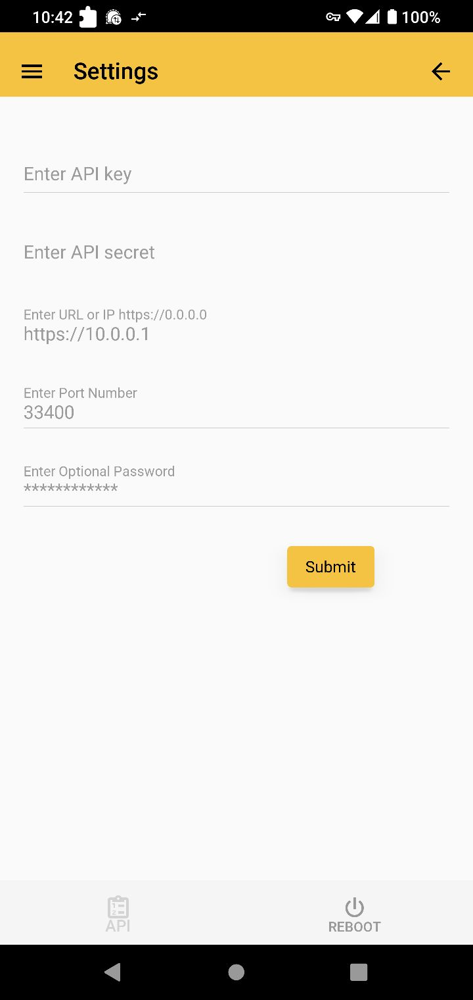</img>  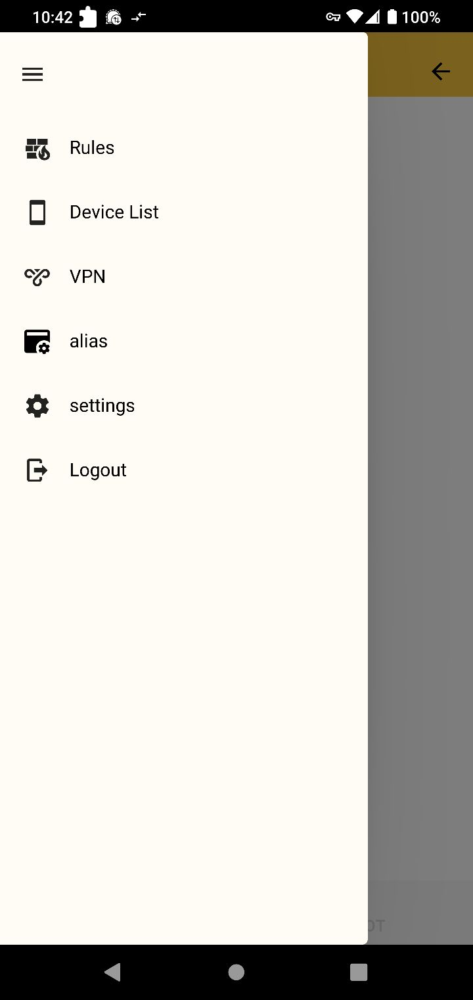  </img>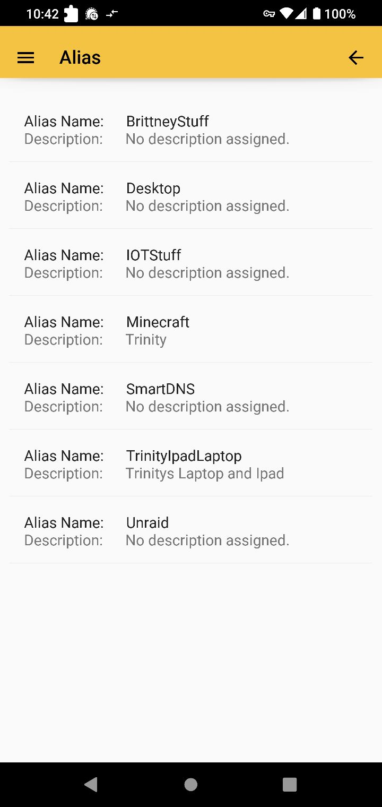</img>  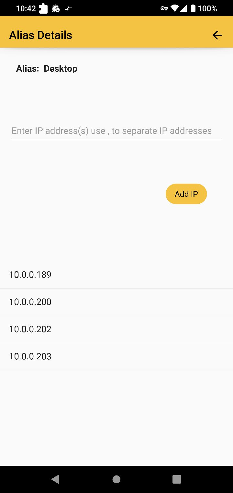</img>  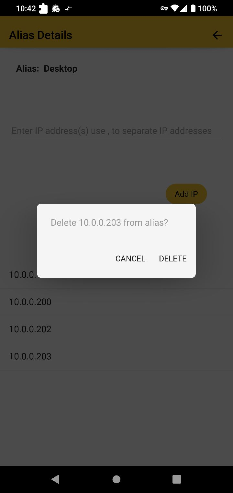</img>  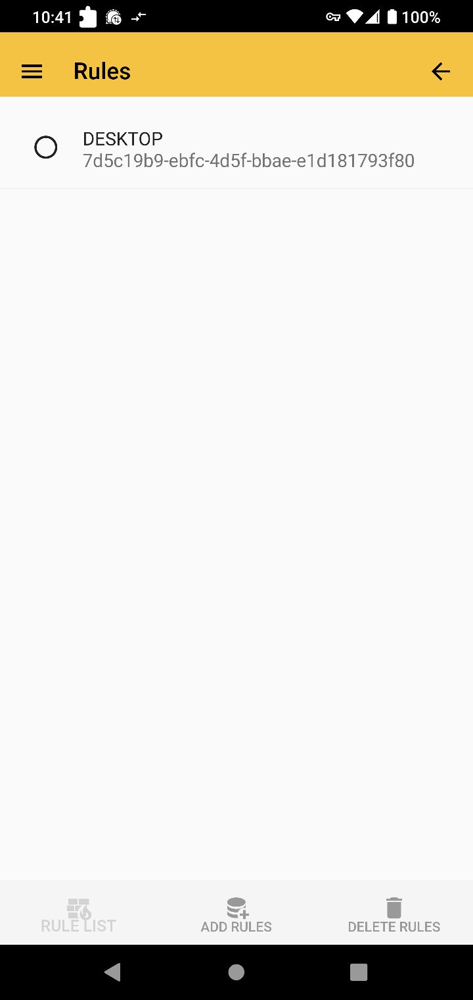</img>  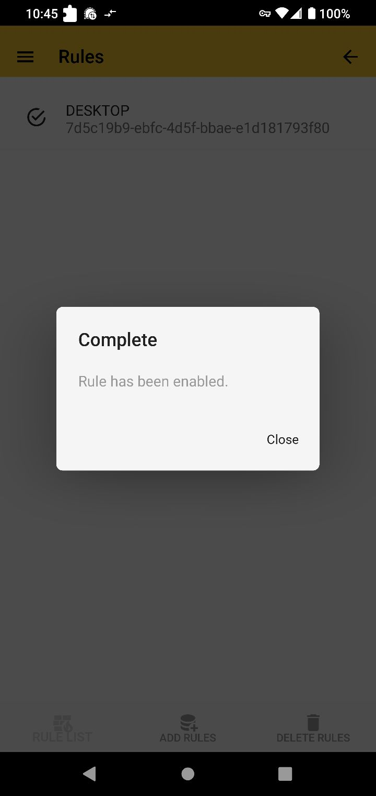</img>  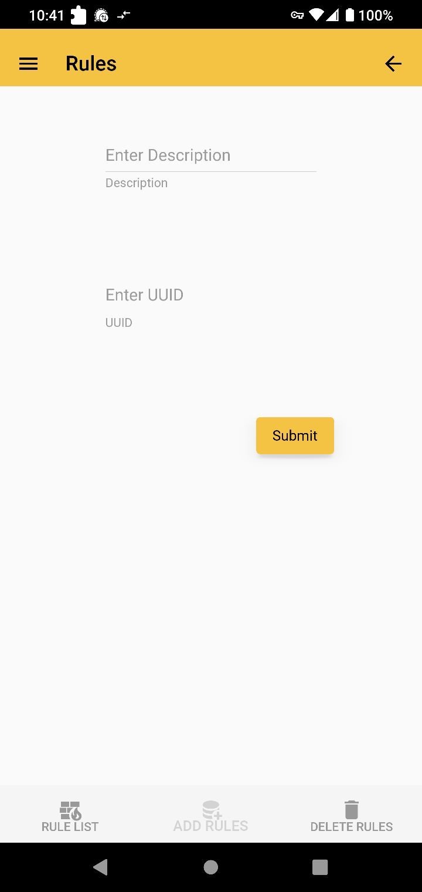</img> 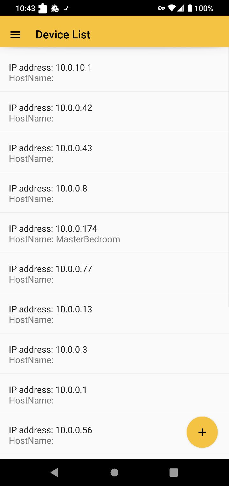</img> 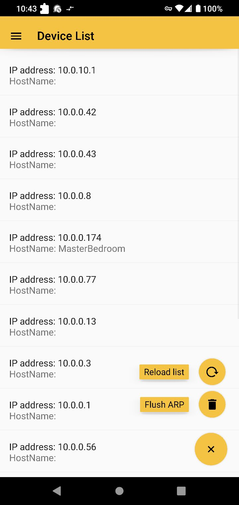</img>  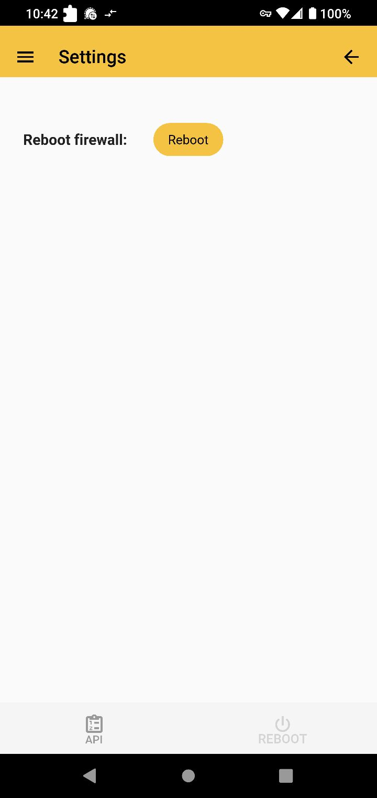</img>
